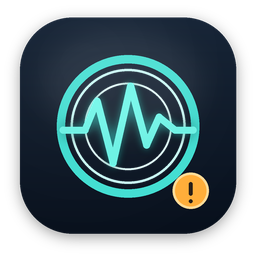
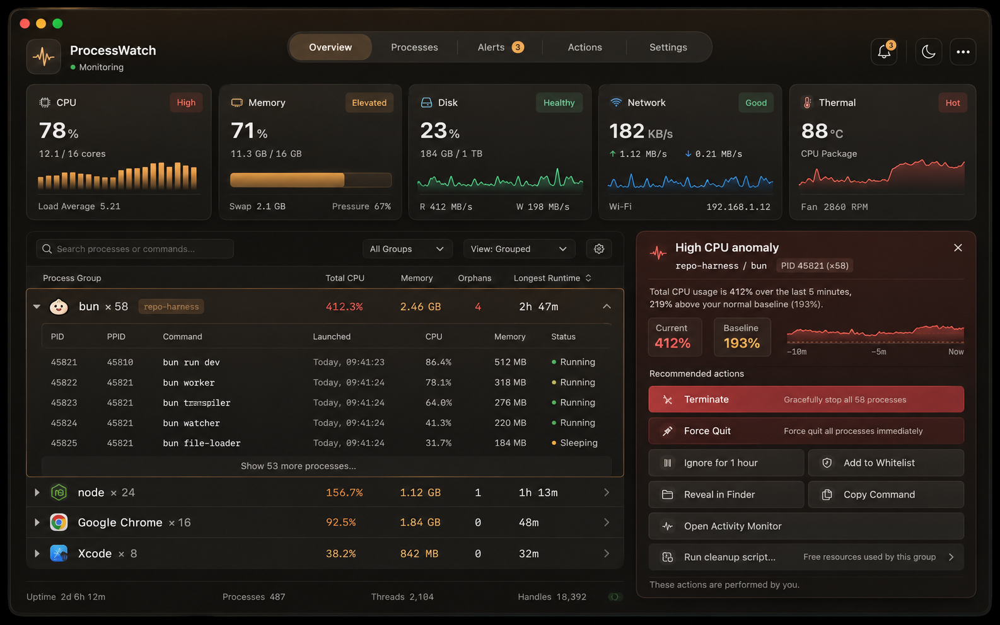

<p align="center">
  
</p>

<h1 align="center">ProcessWatch</h1>

<p align="center">本地优先的 macOS 菜单栏异常进程监控工具。</p>

[English](README.md)

ProcessWatch 用于发现持续高 CPU、内存持续增长、持续写盘、进程风暴、孤儿进程，以及 repo-harness/Codex 调用链异常。它会先按可执行文件聚合进程，再展开查看单个 PID，避免几十个 `bun` 实例平铺后无法定位。

<p align="center">
  
</p>

> 上图是设计概念图。实际实现使用原生 SwiftUI/AppKit，并沿用相同的信息架构与操作逻辑。

> **当前状态：公开 Beta。** 功能已经具备实际诊断价值，但原生采样层和发布产物仍应在多种 macOS 版本、Intel Mac 与 Apple 芯片设备上验证后，再发布稳定版 1.0。

## 主要功能

- 统一的原生深色界面：概览、进程、异常、设置；菜单栏小窗与主窗口共用同一视觉系统
- 菜单栏显示系统 CPU 和异常状态
- 实时趋势卡：CPU、内存压力、进程累计写盘、进程/孤儿数量和热状态
- 按可执行文件路径聚合同名进程
- 展示 PID、PPID、完整命令、工作目录、启动时间、父进程和祖先进程归属
- 检测持续高 CPU、内存增长、持续写盘和进程风暴
- 检测 repo-harness 长时间孤儿进程泄漏
- 异常中心：活动异常与历史记录分离，支持优雅结束、强制退出、只结束孤儿/高 CPU、临时忽略、白名单、Finder、复制命令和活动监视器
- 可运行用户手动选择并确认的清理脚本；不提供误导性的“一键清内存”
- 异常历史与用户操作历史、搜索筛选、JSON 导出、系统通知、忽略列表、登录启动
- 无账号、无云服务、无埋点、无监控数据上传
- SwiftUI + AppKit + libproc/Mach，无运行时第三方依赖

## 从源码运行

环境要求：

- macOS 13 或更高
- Xcode 15 或更高，或兼容的 Xcode Command Line Tools

```bash
./doctor.sh
./build.sh --clean --run
```

构建结果：

```text
dist/ProcessWatch.app
```

其他命令：

```bash
make check
make review
make build
make universal
make dmg
make install
make install-system
```

可直接用 Xcode 打开 `Package.swift`。

## 开源发布与二进制发布

本地构建默认使用 ad-hoc 签名，只适合开发测试。公开发布的 DMG 应完成：

1. Intel + Apple 芯片通用构建；
2. Developer ID Application 签名；
3. Hardened Runtime；
4. Apple notarization；
5. staple 和 Gatekeeper 验证；
6. 发布 SHA-256 校验文件。

配置证书后执行：

```bash
export DEVELOPER_ID_APPLICATION='Developer ID Application: Your Name (TEAMID)'
export NOTARY_PROFILE='ProcessWatchNotary'
./scripts/release.sh
```

完整流程见 [docs/RELEASING.md](docs/RELEASING.md)。

## 隐私

ProcessWatch 只读取本机进程和系统资源元数据，不上传监控数据。异常历史、用户操作历史和偏好保存在当前 macOS 用户目录中。秒级性能曲线只保留在内存短窗口中，不长期写盘。对于普通用户无权读取的系统进程字段，软件会显示“无法读取”，不会要求 root 权限。

详见 [PRIVACY.md](PRIVACY.md) 和 [SECURITY.md](SECURITY.md)。

## 开源协作

- [贡献指南](CONTRIBUTING.md)
- [问题支持](SUPPORT.md)
- [架构说明](docs/ARCHITECTURE.md)
- [v1.5 交互与功能计划](docs/IMPLEMENTATION_PLAN_V1.5.md)
- [界面与进程操作说明](docs/UI_AND_ACTIONS.md)
- [构建说明](docs/BUILDING.md)
- [发布说明](docs/RELEASING.md)
- [故障排查](docs/TROUBLESHOOTING.md)
- [路线图](docs/ROADMAP.md)
- [GitHub 仓库设置](docs/GITHUB_SETUP.md)
- [开源发布审计](docs/OPEN_SOURCE_RELEASE_AUDIT.md)

## Logo

`Assets/` 中包含 SVG 源文件、1024 PNG 和 macOS `.icns` 图标，`docs/assets/` 中包含 GitHub 展示素材。图形表达“进程活动、持续监控和异常提醒”，与项目源码一起使用 MIT License。

## 声明

ProcessWatch 与 Apple、OpenAI、Codex、Bun、repo-harness 没有隶属或官方合作关系。进程归属识别使用启发式规则，结束进程前应人工确认。
